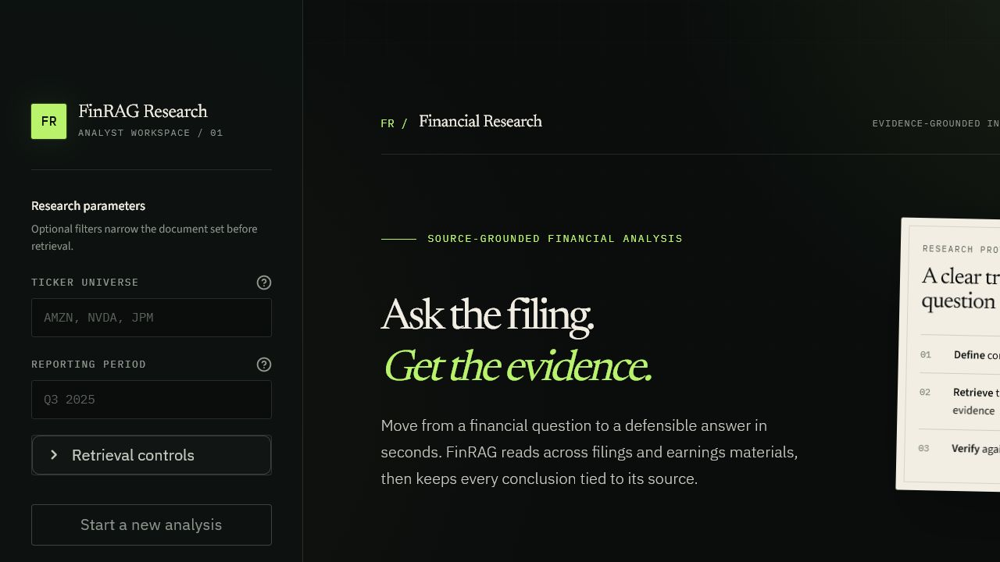
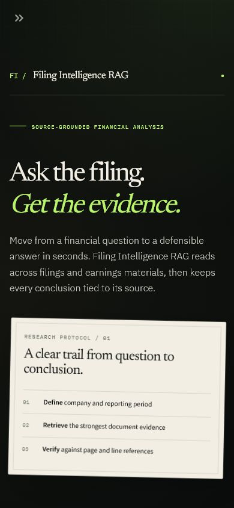
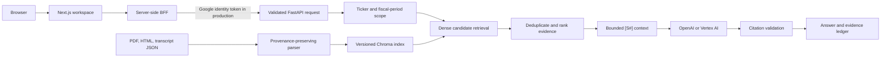

# Filing Intelligence RAG

An evidence-first financial research workspace for asking questions across filings, earnings decks, and call transcripts. FastAPI handles query normalization, retrieval, answer generation, and source delivery; a Next.js 16 and React 19 web application presents the result as an analyst workspace with a traceable evidence ledger.

> Filing Intelligence RAG is a research aid, not investment advice. Answers must be verified against the linked source documents before they are used in a financial decision.

## Product preview



<details>
<summary>Mobile research workspace · 390 px viewport</summary>

<p align="center">
  
</p>

</details>

The rewritten interface is a warm editorial research desk rather than a generic chat shell. It keeps the composer above the fold, gives explicit ticker and period scope precedence over inferred filters, and treats every answer as a briefing sheet with clickable `[S#]` markers and a persistent evidence margin. The evidence inspector exposes source excerpts, page and line provenance, retrieval relevance, and direct cited-page links.

## Deployment status

The screenshots above show the production Next.js workspace running against the packaged evidence index.

- [Research workspace](https://filing-intelligence-rag-7pj7nolpla-uc.a.run.app)
- [API readiness](https://filing-intelligence-rag-api-7pj7nolpla-uc.a.run.app/health/ready)
- [Data coverage](https://filing-intelligence-rag-api-7pj7nolpla-uc.a.run.app/health/data)

## Release snapshot

| Area | Current contract |
| --- | --- |
| Web application | Next.js 16.2.10, React 19.2.7, TypeScript 5.9.3, Motion 12.42.2 |
| API runtime | Python 3.12, FastAPI 0.115.0, Chroma 1.3.5 |
| Packaged corpus | 4,967 passages across 128 documents and 15 companies |
| Embeddings | `chroma-default/all-MiniLM-L6-v2`, 384 dimensions, cosine distance |
| Index artifact | Schema v2, built July 17, 2026 |
| Deployed freshness | `unknown` for all tickers; the current corpus has local-source provenance but no fetch timestamps |

## What is implemented

- Structured ticker and fiscal-period extraction with deterministic fallbacks.
- Metadata-filtered Chroma retrieval over a versioned 384-dimensional MiniLM index.
- Wider candidate retrieval, duplicate suppression, deterministic evidence ranking, and bounded context assembly.
- Inline source identifiers (`[S1]`, `[S2]`) mapped to document, page, line, section, and table provenance where available.
- PDF source viewer with local and Google Cloud Storage document resolution.
- OpenAI and Vertex AI generation providers; an allowlisted OpenRouter path for controlled evaluations.
- Explicit production authentication, bounded API schemas, sanitized failures, request IDs, health/readiness endpoints, and data-freshness reporting.
- Incremental Quartr Public API synchronization with watermarks and sidecar provenance. The signed-in Quartr web application is not scraped.
- A responsive institutional research UI built with Next.js, React, TypeScript, Motion, and accessible evidence and scope controls.
- A server-side backend-for-frontend (BFF) that keeps Google identity-token acquisition out of browser code and returns sanitized API failures.
- Pinned ticker and period scope, inferred-scope clarification, bounded conversation history, clickable inline citations, and a responsive evidence inspector.
- Deterministic Vitest coverage plus lint, type, dependency-audit, and standalone production-build gates for the web application.
- Citation viewers that open on the cited page, search robust line and table-text anchors, and stream PDF byte ranges for reliable PDF.js rendering.

## Request path



The persisted index uses Chroma's explicit `all-MiniLM-L6-v2` embedding contract. Chat-provider embeddings are not computed or discarded during ingestion. Index schema and corpus metadata are recorded alongside rebuilt indexes.

## Local setup

Prerequisites: Python 3.12, Node.js 20.9 or newer, and PowerShell, Bash, or another terminal. CI and production containers use Node.js 24.

```powershell
python -m venv .venv
.\.venv\Scripts\Activate.ps1
python -m pip install -r requirements-dev.txt
npm --prefix frontend install
Copy-Item .env.example .env
```

Set `OPENAI_API_KEY` in `.env`, then start both services:

```powershell
python scripts/run_local.py
```

The launcher restores `chroma_index.zip` into the ignored local index directory on first run. Open the UI at `http://localhost:3000`; the API and interactive schema are at `http://localhost:8000` and `http://localhost:8000/docs`.

For separate processes:

```powershell
python -m uvicorn backend.app.main:app --reload --port 8000
npm --prefix frontend run dev
```

The browser calls same-origin Next.js routes under `/api`. Those BFF routes forward chat, query parsing, and health requests to `FIN_RAG_API_BASE` and validate source links before redirecting to public document routes; in production they attach a Google-signed identity token to protected backend calls server-side. Do not expose backend credentials or identity tokens through `NEXT_PUBLIC_*` variables.

Useful standalone frontend commands:

```powershell
npm --prefix frontend run dev
npm --prefix frontend run lint
npm --prefix frontend run typecheck
npm --prefix frontend run test
npm --prefix frontend audit --omit=dev
npm --prefix frontend run build
npm --prefix frontend run start
```

Run `build` before `start`; the build step prepares the self-contained Next.js server and copies its static assets into the standalone output.

## Rebuild the index

Place supported source files under `data/raw/<ticker>/`. Sidecar metadata generated by the Quartr sync is used when present.

```powershell
python scripts/build_index.py --ticker NVDA --fresh
python scripts/build_index.py --all --fresh
```

`--fresh` replaces the collection, preventing stale chunks from surviving a clean rebuild. Incremental document updates delete the previous chunks for the same stable document ID before upserting replacements.

To refresh data from the supported Quartr API:

```powershell
$env:QUARTR_API_KEY = "..."
python scripts/sync_quartr.py --tickers AAPL,AMZN,NVDA --lookback-days 730
python scripts/build_index.py --all --fresh
```

Quartr Public API access is a separate commercial entitlement; access to the Quartr web application does not include API credentials. This project intentionally does not scrape or bulk-download the signed-in website. Reports and transcripts downloaded individually through an authorized workflow can still be placed under `data/raw/<ticker>/` and indexed with the same build command.

The packaged production corpus currently contains 15 tickers: `AAPL`, `ADS`, `AMZN`, `COST`, `IBM`, `JNJ`, `JPM`, `LOW`, `META`, `NFLX`, `NVDA`, `TGT`, `TSLA`, `V`, and `WMT`. Extend the corpus by adding source documents or by running an entitled API refresh, then perform a clean index rebuild and deployment. The live [data coverage endpoint](https://filing-intelligence-rag-api-7pj7nolpla-uc.a.run.app/health/data) is the source of truth for deployed freshness and coverage.

See [DATA_FRESHNESS.md](DATA_FRESHNESS.md) for watermarks, storage, scheduling, and operational requirements.

## Quality gates

```powershell
$env:PYTHONDONTWRITEBYTECODE = "1"
python -m ruff check backend scripts tests
python -m ruff format --check backend scripts tests
python -m pytest -q
python -m compileall -q backend scripts tests
npm --prefix frontend run lint
npm --prefix frontend run typecheck
npm --prefix frontend run test
npm --prefix frontend audit --omit=dev
npm --prefix frontend run build
```

The current verification baseline is 64 Python checks and 8 frontend checks. The Python suite covers API contracts, auth boundaries, provider failures, query parsing, chunk provenance, retrieval/ranking, citation selection, index compatibility, local index restoration, PDF byte ranges, cited-page navigation, document paths, and data freshness. The frontend gates cover the same-origin BFF contract, realistic corpus source redirects, health-request timing, scope resolution, answer/evidence state, citation identity, linting, type safety, the production dependency audit, and the standalone build.

Run the end-to-end smoke gate against the deployed service pair. It validates the same-origin JSON health response, backend authentication boundary, and a real PDF byte range.

```powershell
python scripts/smoke_deployment.py `
  --backend https://filing-intelligence-rag-api-7pj7nolpla-uc.a.run.app `
  --frontend https://filing-intelligence-rag-7pj7nolpla-uc.a.run.app
```

## Configuration

Copy `.env.example` and review these groups:

- `APP_ENV` / `AUTH_MODE`: local development may use `disabled`; production must use `google`.
- `LLM_PROVIDER`: `openai` or `vertexai`, with the corresponding model credentials.
- `FIN_RAG_API_BASE` / `FIN_RAG_AUTH_MODE`: server-side BFF connection and identity-token mode. Keep both as runtime server variables, not public browser configuration.
- `DOCUMENT_BUCKET`: optional GCS bucket for source documents.
- `QUARTR_API_KEY` / `DATA_*`: optional corpus synchronization and freshness policy.
- `LLM_TIMEOUT_SECONDS`, `LLM_MAX_RETRIES`, and `LLM_MAX_OUTPUT_TOKENS`: bounded provider behavior.

The API rejects unknown request fields, invalid ticker/period formats, retrieval depths outside 1–20, and non-allowlisted evaluation models.

## Deployment

- `Dockerfile.backend` packages the API and versioned Chroma archive.
- `Dockerfile.frontend` builds a Node 24 standalone Next.js image and runs it as a non-root user.
- `cloudbuild.yaml` tests, builds, pushes, and deploys the portfolio `filing-intelligence-rag-api` and `filing-intelligence-rag` Cloud Run services with explicit production auth and readiness probes.
- `cloudbuild.refresh.yaml` synchronizes the corpus, rebuilds the index, publishes durable state, and deploys an immutable `filing-intelligence-rag-api` revision.

Deployment is explicit: the local test suite never mutates cloud resources. Review substitutions, IAM service accounts, Secret Manager grants, Artifact Registry, and the document bucket before running either build.

The Next.js release uses the BFF as its trust boundary: its Cloud Run service account acquires a Google identity token for paid backend routes, while the browser communicates only with same-origin `/api` routes. Health endpoints and cited document viewer/files remain publicly readable, and direct unauthenticated chat requests are rejected.

## Repository map

```text
backend/app/             API, provider clients, security, RAG orchestration
backend/ingestion/       source metadata, parsers, chunking, index manifest/build
backend/vectorstore/     Chroma persistence and retrieval boundary
frontend/                Next.js workspace, BFF routes, components, tests, and styles
scripts/                 local launcher, sync, indexing, evaluation, smoke checks
tests/                   deterministic unit and integration tests
tasks/                   implementation plan, architecture, and review evidence
```

### Gemini evaluation models

The `gemini-3-pro` alias now resolves to OpenRouter `google/gemini-3.1-pro-preview`, replacing the unavailable Gemini 3 Pro endpoint. Saved evaluation results retain their original model labels and scores. The `gemini-3-flash` mapping is unchanged and remains available in the OpenRouter catalog.
