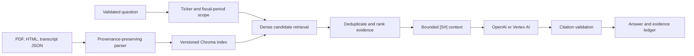

# Filing Intelligence RAG

An evidence-first financial research workspace for asking questions across filings, earnings decks, and call transcripts. FastAPI handles query normalization, retrieval, answer generation, and source delivery; Streamlit presents the result as an analyst workspace with a traceable evidence ledger.

> Filing Intelligence RAG is a research aid, not investment advice. Answers must be verified against the linked source documents before they are used in a financial decision.

## Product preview


<details>
<summary>Mobile research workspace</summary>

<p align="center">
  
</p>

</details>

## Live portfolio demo

- [Research workspace](https://filing-intelligence-rag-7pj7nolpla-uc.a.run.app)
- [API readiness](https://filing-intelligence-rag-api-7pj7nolpla-uc.a.run.app/health/ready)
- [Data coverage](https://filing-intelligence-rag-api-7pj7nolpla-uc.a.run.app/health/data)

## What is implemented

- Structured ticker and fiscal-period extraction with deterministic fallbacks.
- Metadata-filtered Chroma retrieval over a versioned 384-dimensional MiniLM index.
- Wider candidate retrieval, duplicate suppression, deterministic evidence ranking, and bounded context assembly.
- Inline source identifiers (`[S1]`, `[S2]`) mapped to document, page, line, section, and table provenance where available.
- PDF source viewer with local and Google Cloud Storage document resolution.
- OpenAI and Vertex AI generation providers; an allowlisted OpenRouter path for controlled evaluations.
- Explicit production authentication, bounded API schemas, sanitized failures, request IDs, health/readiness endpoints, and data-freshness reporting.
- Incremental Quartr Public API synchronization with watermarks and sidecar provenance. The signed-in Quartr web application is not scraped.
- A responsive institutional research UI with accessible states, evidence cards, scope controls, and deterministic Streamlit tests.

## Request path



The persisted index uses Chroma's explicit `all-MiniLM-L6-v2` embedding contract. Chat-provider embeddings are not computed or discarded during ingestion. Index schema and corpus metadata are recorded alongside rebuilt indexes.

## Local setup

Prerequisites: Python 3.12 and PowerShell, Bash, or another terminal.

```powershell
python -m venv .venv
.\.venv\Scripts\Activate.ps1
python -m pip install -r requirements-dev.txt
Copy-Item .env.example .env
```

Set `OPENAI_API_KEY` in `.env`, then start both services:

```powershell
python scripts/run_local.py
```

The launcher restores `chroma_index.zip` into the ignored local index directory on first run. Open the UI at `http://localhost:8501`; the API and interactive schema are at `http://localhost:8000` and `http://localhost:8000/docs`.

For separate processes:

```powershell
python -m uvicorn backend.app.main:app --reload --port 8000
python -m streamlit run frontend/streamlit_app.py --server.port 8501
```

## Rebuild the index

Place supported source files under `data/raw/<ticker>/`. Sidecar metadata generated by the Quartr sync is used when present.

```powershell
python scripts/build_index.py --ticker NVDA --fresh
python scripts/build_index.py --all --fresh
```

`--fresh` replaces the collection, preventing stale chunks from surviving a clean rebuild. Incremental document updates delete the previous chunks for the same stable document ID before upserting replacements.

To refresh data from the supported Quartr API:

```powershell
$env:QUARTR_API_KEY = "..."
python scripts/sync_quartr.py --tickers AAPL,AMZN,NVDA --lookback-days 730
python scripts/build_index.py --all --fresh
```

Quartr Public API access is a separate commercial entitlement; access to the Quartr web application does not include API credentials. This project intentionally does not scrape or bulk-download the signed-in website. Reports and transcripts downloaded individually through an authorized workflow can still be placed under `data/raw/<ticker>/` and indexed with the same build command.

The packaged production corpus currently contains 15 tickers: `AAPL`, `ADS`, `AMZN`, `COST`, `IBM`, `JNJ`, `JPM`, `LOW`, `META`, `NFLX`, `NVDA`, `TGT`, `TSLA`, `V`, and `WMT`. Extend the corpus by adding source documents or by running an entitled API refresh, then perform a clean index rebuild and deployment. The live [data coverage endpoint](https://filing-intelligence-rag-api-7pj7nolpla-uc.a.run.app/health/data) is the source of truth for deployed freshness and coverage.

See [DATA_FRESHNESS.md](DATA_FRESHNESS.md) for watermarks, storage, scheduling, and operational requirements.

## Quality gates

```powershell
$env:PYTHONDONTWRITEBYTECODE = "1"
python -m ruff check backend frontend scripts tests
python -m ruff format --check backend frontend scripts tests
python -m pytest -q
python -m compileall -q backend frontend scripts tests
```

The test suite covers API contracts, auth boundaries, provider failures, query parsing, chunk provenance, retrieval/ranking, citation selection, index compatibility, local index restoration, document paths, data freshness, and frontend states. Deployment smoke checks are kept in `scripts/smoke_deployment.py` and require explicit service URLs.

```powershell
python scripts/smoke_deployment.py `
  --backend https://filing-intelligence-rag-api-7pj7nolpla-uc.a.run.app `
  --frontend https://filing-intelligence-rag-7pj7nolpla-uc.a.run.app
```

## Configuration

Copy `.env.example` and review these groups:

- `APP_ENV` / `AUTH_MODE`: local development may use `disabled`; production must use `google`.
- `LLM_PROVIDER`: `openai` or `vertexai`, with the corresponding model credentials.
- `FIN_RAG_API_BASE` / `FIN_RAG_AUTH_MODE`: frontend-to-backend connection and identity-token mode.
- `DOCUMENT_BUCKET`: optional GCS bucket for source documents.
- `QUARTR_API_KEY` / `DATA_*`: optional corpus synchronization and freshness policy.
- `LLM_TIMEOUT_SECONDS`, `LLM_MAX_RETRIES`, and `LLM_MAX_OUTPUT_TOKENS`: bounded provider behavior.

The API rejects unknown request fields, invalid ticker/period formats, retrieval depths outside 1–20, and non-allowlisted evaluation models.

## Deployment

- `Dockerfile.backend` packages the API and versioned Chroma archive.
- `Dockerfile.frontend` installs only UI/runtime-auth dependencies.
- `cloudbuild.yaml` tests, builds, pushes, and deploys the portfolio `filing-intelligence-rag-api` and `filing-intelligence-rag` Cloud Run services with explicit production auth and readiness probes.
- `cloudbuild.refresh.yaml` synchronizes the corpus, rebuilds the index, publishes durable state, and deploys an immutable `filing-intelligence-rag-api` revision.

Deployment is explicit: the local test suite never mutates cloud resources. Review substitutions, IAM service accounts, Secret Manager grants, Artifact Registry, and the document bucket before running either build.

The production release uses Google-authenticated frontend-to-backend calls for paid model routes while keeping health and citation documents publicly readable. Direct unauthenticated chat requests are rejected.

## Repository map

```text
backend/app/             API, provider clients, security, RAG orchestration
backend/ingestion/       source metadata, parsers, chunking, index manifest/build
backend/vectorstore/     Chroma persistence and retrieval boundary
frontend/                Streamlit analyst workspace
scripts/                 local launcher, sync, indexing, evaluation, smoke checks
tests/                   deterministic unit and integration tests
tasks/                   implementation plan, architecture, and review evidence
```
